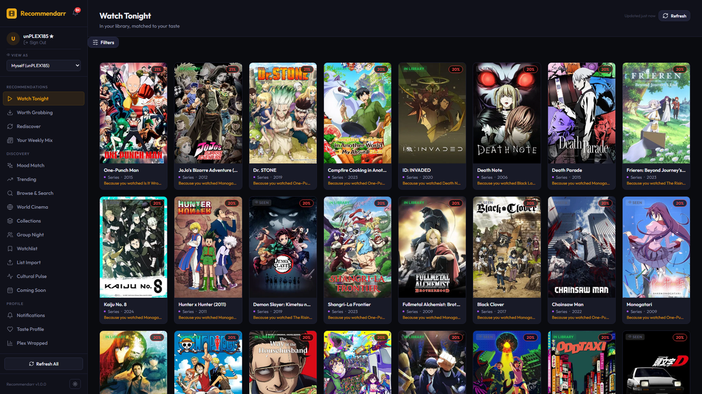
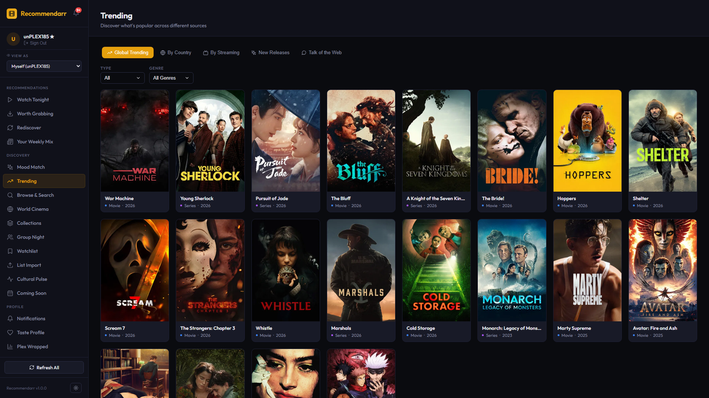
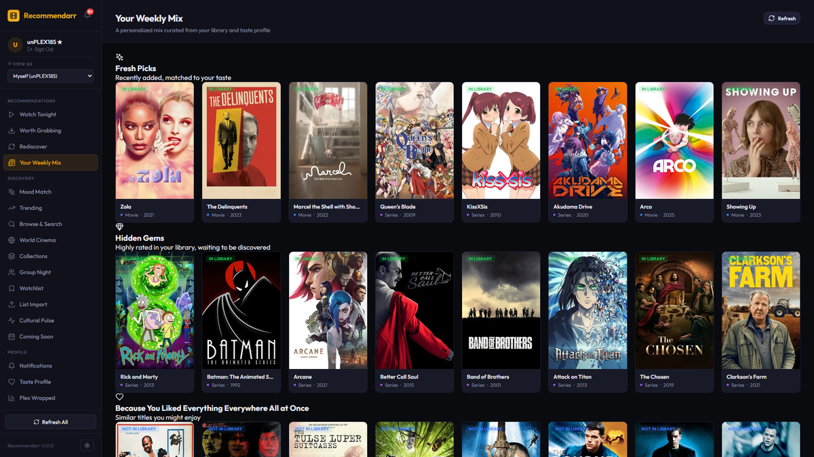
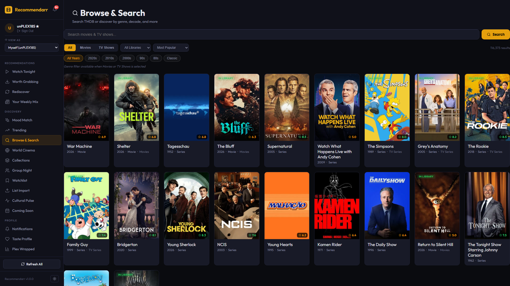
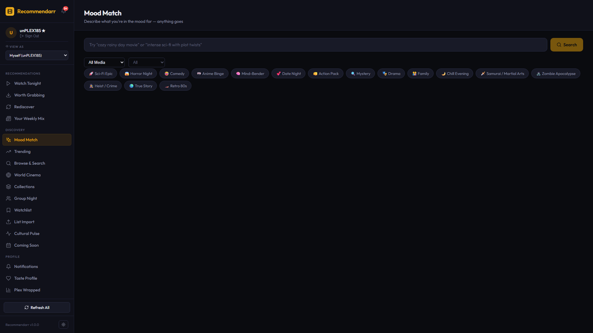
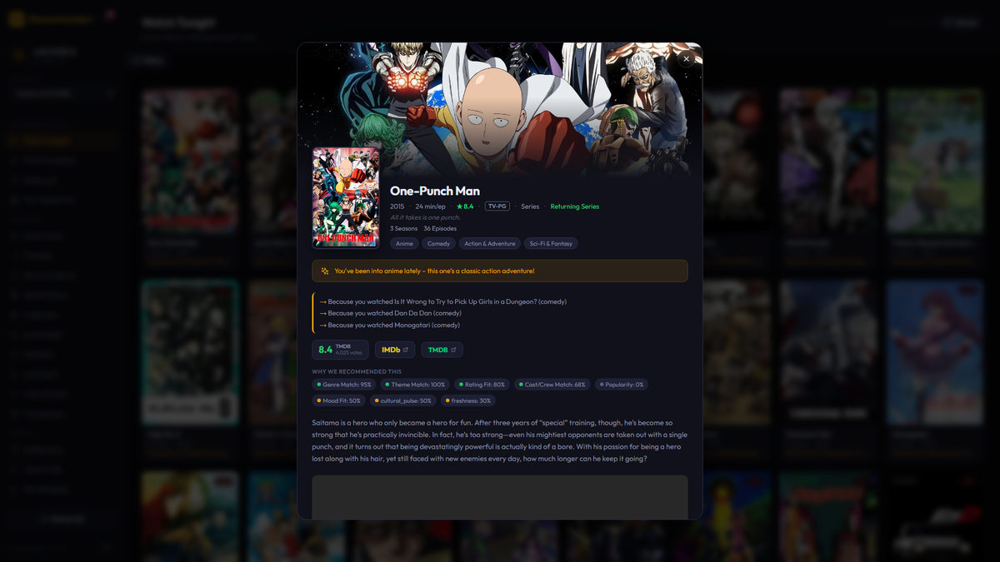
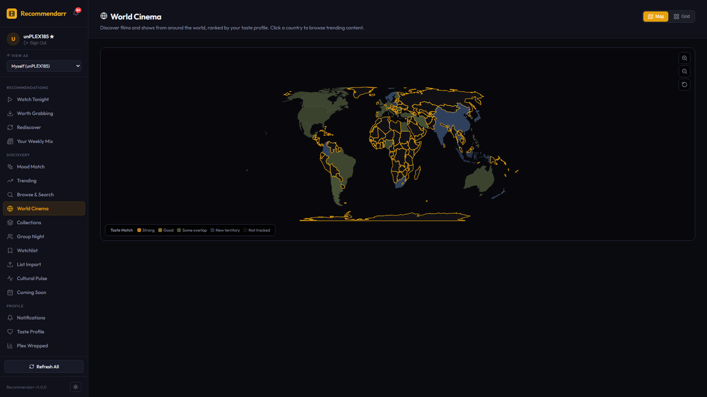
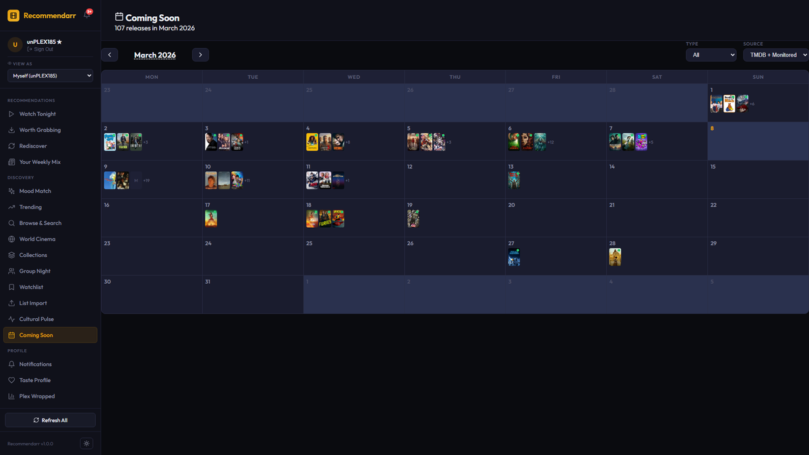
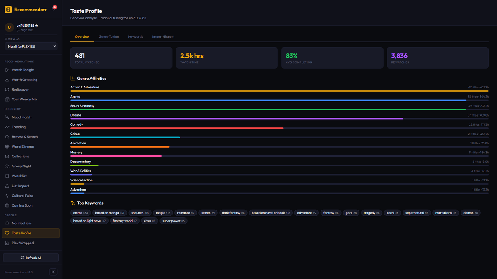
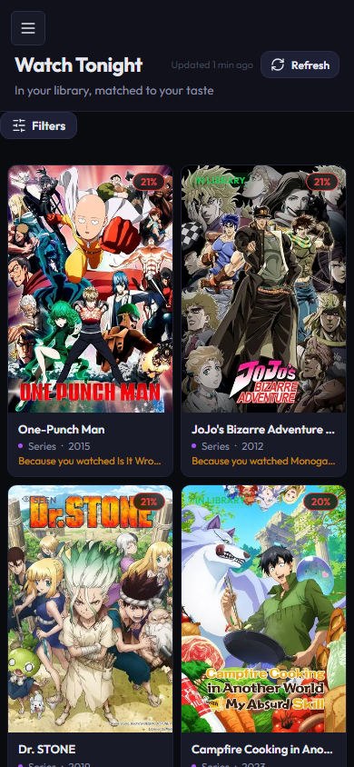

<p align="center">
  
</p>

<h1 align="center">Recommendarr</h1>

<p align="center">
  <a href="https://github.com/Rayce185/Recommendarr/releases"></a>
  <a href="https://hub.docker.com/r/rayce185/recommendarr"></a>
  <a href="https://github.com/Rayce185/Recommendarr/blob/main/LICENSE"></a>
</p>

A self-hosted media recommendation engine for Plex. Learns from viewing behavior across all server users to generate personalized, explainable recommendations.

## Features

- **6 Recommendation Modes**: Watch Tonight, Worth Grabbing, Rediscover, Mood Match, Group Night, Discovery Feed
- **AI-Powered Explanations**: Optional LLM generates natural language "why we picked this" for each recommendation
- **Smart Mood Matching**: Natural language mood input ("just got dumped, distract me, no romcoms") parsed into genre/keyword weights — with LLM enhancement when configured
- **Multi-Source Trending**: Global TMDB, by country, by streaming provider, new releases, anime
- **Collection Tracking**: Detects partially watched franchises (John Wick, MCU, etc.) with completion progress and one-click requests for missing parts
- **Group Night**: Multi-user taste intersection — find what everyone will enjoy
- **Plex Wrapped**: Per-user viewing statistics and insights
- **Social Layer**: Taste overlap scores, server-wide trending, and friend system
- **Friend System**: Request/accept/decline friends, activity feed (what friends watch), friend suggestions based on taste overlap, privacy controls
- **Group Night Friends**: Quick-select friends in Group Night user picker
- **Genre Filters**: Filter trending results by genre across all tabs
- **User-Preferred Countries**: Auto-detected from watch history language distribution — quick-pick chips in By Country tab
- **Series Progress**: Completion progress bars on TV recommendation cards
- **Discovery Feed**: Personalized weekly mix based on taste profile
- **World Cinema Map**: Geographic discovery with taste matching
- **Cultural Pulse**: RSS-powered trending theme detection
- **Coming Soon Calendar**: TMDB + Radarr/Sonarr release tracking
- **Notification Center**: New recommendations, trending, and collection updates
- **Recommendation History**: Full logging with stats and mode breakdown
- **"Because You Watched X"**: Explicit attribution showing which library items drove each recommendation
- **Why Not?**: Negative transparency — explains why titles aren't recommended
- **Advanced Filters**: Year range and rating threshold on recommendation pages
- **Plex OAuth Authentication**: Secure login via Plex account with server access verification
- **Taste Profiles**: Auto-generated from watch history with manual genre/keyword tuning
- **Feedback Loop**: Thumbs up/down/dismiss — adjusts future recommendations
- **Plex Watchlist Integration**: Add/remove directly from recommendation cards
- **Seerr Request Integration**: Request media not yet in your library
- **Admin User Switcher**: Preview any user's recommendations
- **Editable Settings**: Runtime configuration via UI — no restart needed
- **Dark/Light Theme**: OS preference detection with manual override
- **Mobile Responsive**: Works on phones, tablets, and desktops


## Screenshots

<table>
<tr>
<td width="50%"><br/><b>Watch Tonight</b> — Personalized recommendations with poster art and explanations</td>
<td width="50%"><br/><b>Trending</b> — Global and per-country trending with genre filters</td>
</tr>
<tr>
<td><br/><b>Discovery Feed</b> — Personalized weekly mix based on taste profile</td>
<td><br/><b>Browse & Search</b> — Full-text search with advanced filters</td>
</tr>
<tr>
<td><br/><b>Mood Match</b> — Natural language mood input with AI enhancement</td>
<td><br/><b>Title Details</b> — Rich overlay with cast, ratings, streaming availability</td>
</tr>
<tr>
<td><br/><b>World Cinema</b> — Geographic discovery with taste matching</td>
<td><br/><b>Coming Soon</b> — TMDB + Radarr/Sonarr release calendar</td>
</tr>
<tr>
<td><br/><b>Taste Profile</b> — Auto-generated from watch history with manual tuning</td>
<td><br/><b>Mobile</b> — Fully responsive on phones and tablets</td>
</tr>
</table>

## Quick Start

### Docker (recommended)

```bash
docker run -d \
  --name recommendarr \
  --restart unless-stopped \
  -p 5055:5055 \
  -v /path/to/data:/app/data \
  -e PLEX_URL=http://your-plex:32400 \
  -e PLEX_TOKEN=your-plex-token \
  -e TAUTULLI_URL=http://your-tautulli:8181 \
  -e TAUTULLI_API_KEY=your-tautulli-key \
  -e TMDB_API_KEY=your-tmdb-key \
  -e RADARR_URL=http://your-radarr:7878 \
  -e RADARR_API_KEY=your-radarr-key \
  -e SONARR_URL=http://your-sonarr:8989 \
  -e SONARR_API_KEY=your-sonarr-key \
  -e SEERR_URL=http://your-seerr:5055 \
  -e SEERR_API_KEY=your-seerr-key \
  -e TZ=America/New_York \
  rayce185/recommendarr:latest
```

Open `http://your-server:5055` and log in with your Plex account.

### Docker Compose

```bash
git clone https://github.com/Rayce185/Recommendarr.git
cd Recommendarr
cp .env.example .env
# Edit .env with your API keys (see .env.example for full docs)
docker compose up -d
```

### unRAID

Install via Community Applications — search for "Recommendarr". Or use the Docker template manually from this repo.

## Stack

- **Backend**: Python / FastAPI
- **Frontend**: React (Vite)
- **Services**: Plex, Tautulli, Radarr, Sonarr, Seerr, TMDB
- **Optional AI**: Ollama, OpenAI-compatible, OpenAI, or Anthropic for enhanced features

## Requirements

- Docker
- Plex Media Server (with admin token)
- Tautulli (for watch history)
- At least one of: Radarr, Sonarr (for library data)
- Seerr/Overseerr (for TMDB discovery + request proxy)
- TMDB API key (free at [themoviedb.org](https://www.themoviedb.org/settings/api))

## Optional: AI Integration

Recommendarr works without any LLM — all features have deterministic fallbacks. To enable AI-enhanced features:

1. Go to **Settings → AI Integration** in the web UI
2. Select a provider (Ollama, OpenAI-compatible, OpenAI, or Anthropic)
3. Configure endpoint + model
4. Enable features: **AI Mood** (natural language parsing) and/or **AI Explanations** (LLM-generated recommendation reasons)

Tested with **Ollama + gemma3:4b** (runs on any modern GPU with 4GB+ VRAM).

## API

46+ REST endpoints. Interactive docs at `/api/docs` when running.

## Contributing

Pull requests welcome. Please open an issue first to discuss significant changes.

## License

[MIT](LICENSE)
